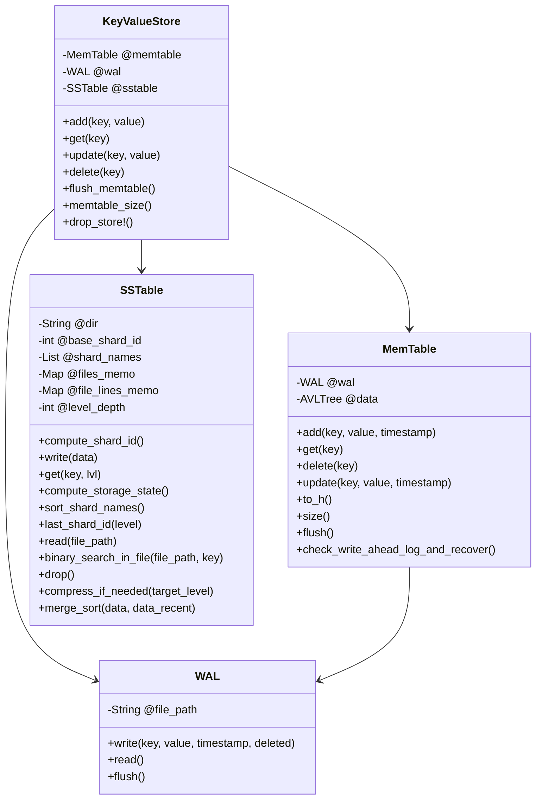

# Key-Value Storage with Write-Ahead Log, LSM Tree, and SSTable

This repository is a practice project focused on building a key-value storage system.
It uses the SSTable, [LSM Tree](https://github.com/nahi/avl_tree) and Write-Ahead Log components.
It compresses files with merge sort algorithm. It includes a configuration file that you can set the size limits and compaction trigger numbers.

## Resources and Related Information

For a deeper understanding, check out these resources:
- [Understanding Log-Structured Merge Trees (LSM)](https://www.youtube.com/watch?v=ciGAVER_erw)
- [SSTables: The Building Blocks of LSM Trees](https://www.youtube.com/watch?v=6yJEwqseMY4)
- [Write-Ahead Logging Explained](https://www.youtube.com/watch?v=W_v05d_2RTo)

## How to Run

### Loading Dependencies

First, install the necessary dependencies:

```bash
bundle install
```

## Running the Program
You can run the program using the following command:

```bash
ruby bin/run.rb
```

## Running Unit Tests
To run the unit tests, use in terminal:

```bash
rspec --format documentation
```


## How to use

```ruby
require_relative 'lib/key_value_store'

# Create an instance of the KeyValueStore
store = KeyValueStore.instance

# Add a key-value pair
store.add('key', 'value')

# Get the value of a key
store.get('key')

# Update the value of a key
store.update('key', 'new_value')

# Delete a key
store.delete('key')

```


## Configuration

You can use the `config/constants.rb` file for adjustments.

```ruby
module Constants
  MEMTABLE_SIZE_LIMIT = 30
  PARTITION_LIMIT_PER_LEVEL = 2
end
```

**MEMTABLE_SIZE_LIMIT**: Determines the lines limit will be written per file, for the memory table, and level 0 SSTable.
**PARTITION_LIMIT_PER_LEVEL**: Determines the compaction interval. When the number of the files(partitions) reaches to this number then the compaction starts.


## Basic representation of the class relationship


