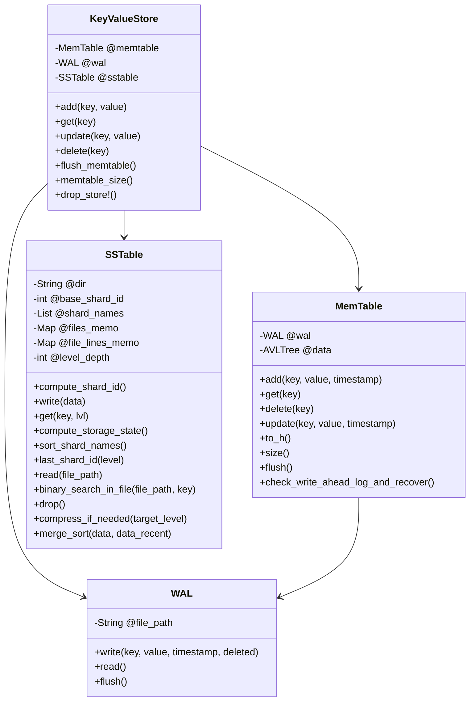

# Key-Value Storage with Write-Ahead Log, LSM Tree, and SSTable

This repository is a practice project focused on building a key-value storage system using the SSTable architecture.

## Resources and Related Information

For a deeper understanding, check out these resources:
- [Understanding Log-Structured Merge Trees (LSM)](https://www.youtube.com/watch?v=ciGAVER_erw)
- [SSTables: The Building Blocks of LSM Trees](https://www.youtube.com/watch?v=6yJEwqseMY4)
- [Write-Ahead Logging Explained](https://www.youtube.com/watch?v=W_v05d_2RTo)

## How to Run

### Loading Dependencies

First, install the necessary dependencies:

```bash
bundle install
```

## Running the Program
You can run the program using the following command:

```bash
ruby bin/run.rb
```

## Running Unit Tests
To run the unit tests, use:

```bash
rspec --format documentation
```

## Basic representation of the class relationship


